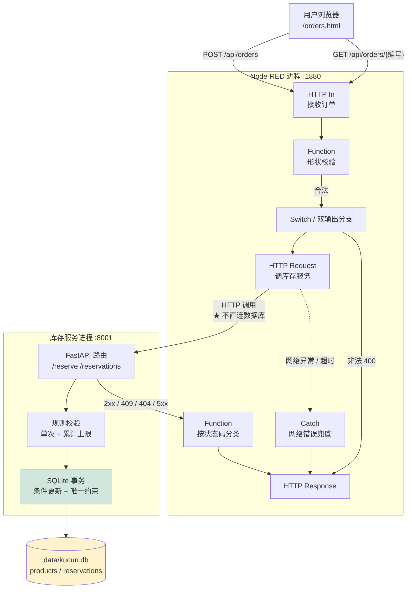

# order-workflow-system —— 开源工作流自动化与服务集成系统

《开源软件与新技术》实验06 成品。用 **Node-RED 5.0.7** 做事件驱动的订单编排，
配一个**自己实现的 FastAPI 库存服务**（SQLite 事务 + 幂等 + 规则版本），
再由 Node-RED 提供面向普通用户的操作页面。

在实验要求之外补了一项自主功能：**按商品类别的领用上限规则 + 规则版本记录**。

- 作者：王锐兵（软件2304，学号 23110506126）
- 操作页面：<http://127.0.0.1:1880/orders.html>
- 流程编辑器：<http://127.0.0.1:1880/editor>
- 库存服务文档：<http://127.0.0.1:8001/docs>

> 本仓库是二次开发成品，**不是** Node-RED / FastAPI 的再分发。
> 上游自带能力与我实现的部分在 [NOTICE.md](NOTICE.md) 里逐项区分。

---

## 一、目标用户与问题场景

**目标用户**：需要一个"申请 → 审批规则 → 扣库存 → 记录可查"轻流程的
校内物资管理员 / 实验室助教。

**问题场景**：这类流程通常就记在聊天记录或 Excel 里，三个具体麻烦：

1. **重复提交会重复扣库存**——申请人在网慢的时候点两下，货就少了两份。
2. **超时了不知道该不该重试**——不是"失败"，是"不知道成没成"。
3. **规则改了以后说不清**——"当时是按哪条上限批的？"没人答得上来。

**功能清单**：

| 功能 | 说明 |
| --- | --- |
| 提交申请 | 编号 + 商品 + 数量，校验后调库存服务 |
| 幂等保证 | 同一编号 + 同内容 → 不重复扣减；同号不同内容 → 409 冲突 |
| 状态分支 | 成功 / 库存不足 / 编号冲突 / 参数错误 / 依赖失败 各自独立响应 |
| 按编号查询 | 超时后"先查再决定"就靠这个接口 |
| 记录列表 | 按状态筛选、查看详情 |
| **领用上限规则** | 单次上限 + 单类累计上限，带**规则版本**（自主功能） |
| 异常记录 | 网络错误/超时记到 Node-RED Context，供排障参考 |
| 操作页面 | 表单、进度、结果、历史、筛选、详情，全部读真实接口 |

---

## 二、技术栈与架构

| 组件 | 版本 | 说明 |
| --- | --- | --- |
| Node.js | 22.22.2 | Node-RED 5.0.7 要求 ≥ 22.9 |
| Node-RED | **5.0.7** | 固定版本，项目本地安装（不用 `-g`） |
| FastAPI | 见 `service/requirements.txt` | 库存服务框架 |
| Uvicorn | 见 `service/requirements.txt` | ASGI 服务器 |
| SQLite | Python 自带 `sqlite3` | 库存与预留记录 |
| 端口 | Node-RED 1880 / 库存服务 8001 | 冲突时改配置并同步 README |

### 架构



### 边界说明（本实验的重点）

| 谁 | 拥有什么 | 不做什么 |
| --- | --- | --- |
| Node-RED | 编排、形状校验、错误分类、页面 | **不碰** SQLite；不做业务判断 |
| 库存服务 | 商品、库存、预留记录、规则、事务 | 不做页面；不管重试策略 |
| SQLite | 数据落地（只有库存服务能打开） | — |

**为什么坚持这个边界**：如果让 Node-RED 直接读 `kucun.db`，
那么"数据归谁所有"就没了。以后库存服务换实现、加缓存、上集群，
编排层都得跟着改。通过 HTTP 契约调用才是可替换的。

---

## 三、环境要求

```powershell
node --version      # 需要 >= 22.9
python --version    # 3.11+
git --version
```

端口占用检查：

```powershell
Get-NetTCPConnection -LocalPort 1880,8001 -State Listen -ErrorAction SilentlyContinue
```

---

## 四、安装、启动、停止

### 安装

```powershell
.\scripts\anzhuang.ps1
# 换镜像： .\scripts\anzhuang.ps1 -Jingxiang https://pypi.tuna.tsinghua.edu.cn/simple/
```

脚本做四件事：检查 Node 版本（低于 22.9 直接拒绝，**不用忽略 engines 硬装**）
→ 建 `.venv` 装库存服务依赖 → `npm install --save-exact node-red@5.0.7`
→ 跑一遍测试。

### 启动（顺序有讲究）

```powershell
.\scripts\qidong.ps1
```

**先起库存服务，再起 Node-RED**。反过来的话 Node-RED 一起来就去调库存服务
会拿到连接拒绝，虽然不会崩，但日志里一串错误会误导排障。
两个进程都靠**健康检查轮询**确认就绪，不用固定 `sleep`。

手动启动（脚本背后做的事）：

```powershell
# ① 库存服务
.\.venv\Scripts\python.exe -m uvicorn app:app --host 127.0.0.1 --port 8001
#   工作目录要在 service\ 下

# ② Node-RED
node node_modules\node-red\red.js `
  --userDir .\data\node-red `
  --settings .\settings.js `
  .\flows\orders.json
```

### 停止

```powershell
.\scripts\tingzhi.ps1        # 按端口停，不会误伤别的 python/node 进程
```

### 数据初始化 / 重建

```powershell
.\scripts\zhongzhi.ps1                 # 幂等灌种子，不动已有库存
.\scripts\zhongzhi.ps1 -Chongjian      # 删库重建（要手打确认）
```

---

## 五、演示流程

```powershell
.\scripts\qidong.ps1      # 起服务
.\scripts\yanshi.ps1      # 跑 6 条演示申请 + 1 条幂等验证
```

| # | 编号 | 商品 | 数量 | 预期 |
| --- | --- | --- | --- | --- |
| 1 | SY-001 | A4ZHI | 5 | 200 成功 |
| 2 | SY-002 | SHUBIAO | 2 | 200 成功（低库存但够） |
| 3 | SY-003 | TOUYING | 1 | 409 零库存 |
| 4 | SY-004 | JIANPAN | 5 | 409 库存不足（只有 1） |
| 5 | SY-005 | A4ZHI | 0 | 400 数量非法 |
| 6 | SY-006 | BUCUNZAI | 1 | 404 商品不存在 |
| 7 | SY-001 再提交一次 | A4ZHI | 5 | 200 但 `chongfu=true`，**库存不再扣** |

页面演示：

1. 打开 <http://127.0.0.1:1880/orders.html>
2. 选一个商品，右侧实时显示**服务端**库存（页面不做本地扣减）
3. 提交后看结果框；重复提交同一个编号会显示黄色"幂等命中"
4. 在「记录列表」按状态筛选，点「详情」看抽屉
5. 「商品库存总览」里能看到 SY-002 之后 SHUBIAO 从 3 变 1

### 演示数据

`service/zhongzi.py` 里有 **11 种商品**，库存刻意做成阶梯：
充足（120/300/80/60/45/200）、低库存（3/1/5/4）、零库存（0/0）。
全部是虚构数据，不接任何真实系统。

---

## 六、几个关键设计

### 6.1 幂等：编号 + 内容双绑定

`reservations.request_id` 是主键，插入前先查：

| 情况 | 行为 |
| --- | --- |
| 编号不存在 | 正常预留 |
| 编号存在且**内容相同** | 返回原结果，标记 `chongfu=true`，**不扣库存** |
| 编号存在但**内容不同** | 409，说明"同号不同内容" |

**为什么内容也要绑**：只按编号去重的话，
调用方改了数量再提交会被静默当成"重复请求"返回成功，
但数据完全没动——调用方以为处理了，实际没有。这是最危险的假成功。

### 6.2 不超卖：条件更新 + 检查受影响行数

```sql
UPDATE products SET kucun = kucun - ?
WHERE sku = ? AND kucun >= ?
```

把"库存够不够"写进 `WHERE`，让数据库自己做原子判断。
`rowcount != 1` 说明并发里被别人抢先了，**立即回滚并返回 409**，
绝不返回成功。

如果写成"先 SELECT 查够不够，再 UPDATE"，两条并发请求会都读到"够"，
然后都去扣，就超卖了。有一条并发测试专门盯这个。

### 6.3 错误分类：业务拒绝 ≠ 依赖故障

| 状态码 | 含义 | 该怎么办 |
| --- | --- | --- |
| 2xx | 成功 | — |
| 409 | **业务拒绝**（缺货/编号冲突/超规则上限） | 改输入，**可以用同一个编号**重试 |
| 404 | 商品不存在 | 改商品 |
| 400 | 请求有问题 | 改请求 |
| 5xx → 502 | **依赖失败** | 别急着重试，先查编号 |

这两类必须分开：业务拒绝改输入就行，依赖故障要等。
一律返回 200 或者一律返回 500 都会让调用方无法正确决策。

### 6.4 超时 ≠ 失败

`Catch` 节点捕获网络错误/超时后，**不返回"失败"**，而是返回：

> 结果未知。请先用同一个编号查 `GET /api/orders/{编号}` 确认是否已经扣减，
> 再决定要不要重试。不要直接重复提交。

**理由**：超时只说明"我没等到回包"，不代表"对方没执行"。
对方可能已经扣了库存只是回包丢了。先查再决定是唯一正确的做法。

### 6.5 自主功能：领用上限规则 + 规则版本

上游 Node-RED 没有业务规则概念，FastAPI 也不是库存成品，这一块完全是本人实现的：

- **单次上限** `danci_zuida`：一次申请不能超过 N 件
- **单类累计上限** `meilei_zuida`：同一商品的历史成功领用总和不能超过 M 件
- **规则版本** `banben`：每次修改产生新版本，**每笔预留记录都写清当时用了哪一版**

**为什么版本这么重要**：规则改过之后，事后审计必须能回答
"这笔申请当时是按哪一版批的"。没有版本号，历史记录就失去了可解释性。

规则校验**放在扣减之前**——被规则拒掉的请求绝不能动库存。
有一条测试 `test_guize_jujue_bu_dong_kucun` 专门盯这个。

### 6.6 Context vs SQLite

这个区别是本实验最容易被混淆的地方：

| 维度 | Node-RED 文件 Context | SQLite（库存服务） |
| --- | --- | --- |
| 本质 | 键值缓存 + 定期刷盘 | 事务型关系数据库 |
| 崩溃时会丢吗 | **可能丢最后一小段** | 事务提交后就持久 |
| 唯一约束 | 没有 | 有 |
| 并发原子更新 | 没有 | 有（`WHERE ... >= ?`） |
| 本实验拿它存什么 | 异常记录（参考信息） | 库存、预留记录（业务数据） |
| 能存业务数据吗 | **不能** | 能 |

所以库存**必须**写 SQLite，Node-RED 的 Context 只用来记异常时间线。

---

## 七、测试

```powershell
.\scripts\ceshi.ps1                                # 全部
.\.venv\Scripts\python.exe -m pytest tests -q      # 只跑 pytest
```

**实测结果：61 passed in 45.63s**

| 测试类型 | 实验要求 | 本仓库 | 文件 |
| --- | --- | --- | --- |
| 服务与契约测试 | ≥6 | 22 条 | `tests/test_api.py` |
| 编排功能测试 | ≥6 | 14 条 | `tests/test_flows.py` |
| 库存与幂等测试 | ≥5 | 20 条 | `tests/test_kucun.py` |
| 故障与恢复测试 | ≥4 | 含在契约与库存测试里（503/冲突/临界/重启持久化） | — |
| 界面与自主测试 | ≥5 | 规则边界 5 条 + 页面调真实接口的静态检查 | — |

几个值得单说的用例：

| 用例 | 断言什么 |
| --- | --- |
| `test_bingfa_bu_chaomai` | 库存只够一条时，两条并发**恰好一条成功**，库存不为负 |
| `test_bingfa_tongyibianhao_zhi_kou_yici` | 两个线程提交完全相同的请求，库存只扣一次 |
| `test_zhongzi_chongfu_zhixing_bu_huanyuan_kucun` | 反复跑种子脚本不会把扣掉的库存还原 |
| `test_chaoshi_hou_xian_cha_zai_jueding` | 未知编号返回 404 → 确认没执行 → 可以用同一编号重试 |
| `test_function_buyao_yong_huifu_xin_duixiang` | 静态检查 Function 有没有丢 `msg.res` |
| `test_meige_http_in_dou_neng_zou_dao_http_response` | 遍历连线，每个入口都必须能走到响应节点 |

### 关于编排测试的说明

本机**没有跑 Node-RED**（`npm install node-red` 需要下载约 80MB），
所以 `test_flows.py` 做的是**静态验证**：把流程 JSON 当数据处理，
检查连线是否悬空、输出路数是否匹配、是否保留了 `msg.req/msg.res`、
是否每个入口都能走到响应节点。

这**不是**"假装跑过了"。它确实能抓到几类真实会犯的错误，
但**不能**替代端到端运行。未实跑的部分已如实记录在
[docs/ceshi-jilu.md](docs/ceshi-jilu.md)。

---

## 八、安全注意事项

| 风险 | 处理 |
| --- | --- |
| 编辑器暴露到局域网 | `uiHost: "127.0.0.1"` 只绑回环；**开放访问前必须配认证** |
| 页面 XSS | 前端所有接口文本过 `zhuanYi()`，不拼 `innerHTML` |
| 前端伪造库存 | 页面**只显示**服务端库存，不做任何本地扣减 |
| 前端防重复点击 | 只做体验优化；**真正的不重复靠服务端唯一约束 + 事务** |
| 用户输入进 SQL | 全部用参数化查询（`?` 占位），没有字符串拼接 |
| 用户输入进命令 | 没有 `eval`、没有 `child_process`、没有系统命令调用 |
| 凭据 | 本实验不需要任何密钥；`.env` 已在 `.gitignore` 里 |

---

## 九、上游与第三方资源

| 项目 | 用途 | 版本 | 许可证 |
| --- | --- | --- | --- |
| [Node-RED](https://github.com/node-red/node-red) | 工作流编排 | 5.0.7 | Apache-2.0 |
| [FastAPI](https://github.com/fastapi/fastapi) | 库存服务框架 | 见 requirements | MIT |
| [Uvicorn](https://github.com/encode/uvicorn) | ASGI 服务器 | 见 requirements | BSD-3-Clause |
| [Pydantic](https://github.com/pydantic/pydantic) | 请求校验 | 见 requirements | MIT |

完整清单与"上游能力 vs 本人实现"的对照见 [NOTICE.md](NOTICE.md)。
本仓库采用 **MIT**。

---

## 十、已知限制

1. **没有实跑 Node-RED 端到端**（本机未安装；编排层是静态验证）。
   库存服务本身是实跑的，61 条测试全过。
2. **SQLite 只适合单机**。本实验解决了单机范围内的幂等和并发一致性，
   **不等于**解决了分布式事务。多实例部署时需要换成真正的数据库
   + 分布式锁或队列。
3. **Node-RED Context 不持久可靠**，异常记录可能丢最后一小段。
4. **没有认证**。任何人访问到 1880 都能提交申请。
   对外发布必须先加认证和权限。
5. **没有自动重试**。指导书建议"仅在库存服务通过幂等测试后才可加有限重试"——
   幂等已经验证过了，但自动重试这次没实现，只给了人工重试指引。
6. 库存服务的写操作加了进程内锁，单进程下行为可预测；
   多进程（多 worker）时该锁失效，需要靠 SQLite 自己的锁 + `busy_timeout`。

---

## 十一、目录结构

```
order-workflow-system/
├── README.md
├── LICENSE                      # MIT
├── NOTICE.md                    # 上游能力 vs 本人实现的对照
├── package.json                 # 固定 node-red@5.0.7
├── settings.js                  # uiHost/httpAdminRoot/httpStatic/contextStorage
├── flows/
│   ├── baseline.json            # 基线：最小 HTTP 流程
│   └── orders.json              # ★ 主流程（编排、分支、错误分类）
├── service/                     # ★ 独立库存服务
│   ├── app.py                   # FastAPI 路由与状态码契约
│   ├── kucun.py                 # 事务、幂等、规则版本
│   ├── zhongzi.py               # 11 种商品的种子数据
│   └── requirements.txt
├── web/                         # 操作页面（由 Node-RED httpStatic 提供，同源）
│   ├── orders.html
│   ├── orders.css
│   └── orders.js
├── tests/                       # 61 条 pytest
├── scripts/                     # 安装/启动/停止/种子/演示/测试
├── data/                        # 运行时数据库与 Node-RED userDir（不入库）
└── docs/                        # 报告、Issue、测试记录
```

---

## 十二、思考题

**1. Function 节点与独立业务服务分别适合承载什么逻辑？**

| | Function 节点 | 独立业务服务 |
| --- | --- | --- |
| 适合 | 消息形状转换、字段校验、路由分支 | 事务、幂等、唯一约束、跨请求状态 |
| 不适合 | 事务、并发控制、持久化 | 协议转换、路由编排 |
| 状态 | 只有内存/文件 Context，非事务 | 数据库事务 |
| 可测试性 | 难（要跑 Node-RED） | 易（pytest 直接测） |

一句话：**无状态、单条消息内的逻辑放 Function；有状态、需要原子性的放服务。**

**2. HTTP 503、网络超时与业务缺货为什么应区别处理？**

| 情况 | 谁的问题 | 数据变了吗 | 该怎么办 |
| --- | --- | --- | --- |
| 业务缺货（409） | 请求方 | **明确没变** | 改数量重试，同一编号可用 |
| 依赖 503 | 服务方 | 明确没变 | 等依赖恢复再重试 |
| 网络超时 | 不知道 | **不知道** | 先按编号查，再决定 |

前两者可以确定"没执行"，第三者不能确定。把三者混为一谈，
要么会重复扣库存，要么会让用户以为失败而放弃一个其实成功的请求。

**3. 唯一请求编号为何还要与请求内容绑定？**

只按编号去重的话，"同号不同内容"会被静默当成重复请求返回成功，
但数据完全没动。调用方拿到 200 就以为处理了，实际是个**假成功**——
这种错误在事后极难发现（日志显示成功，数据对不上）。

绑定内容后，这种情况返回 409，调用方立刻知道出了什么问题。

**4. 文件 Context、SQLite 事务与分布式事务分别保证什么？**

| 机制 | 保证 | 不保证 |
| --- | --- | --- |
| 文件 Context | 进程重启后大致能读到（有刷盘窗口） | 事务、唯一约束、并发原子更新 |
| SQLite 事务 | ACID（单机范围内）、唯一约束、条件更新的原子性 | 跨进程/跨机器的一致性 |
| 分布式事务 | 跨多个独立服务的一致性（2PC/Saga 等） | 复杂度、性能都会显著上升 |

本实验用的是第二档，**只能保证单机**。指导书也明确说了
"SQLite 适合课程单机应用，这不等于已解决分布式事务"。

**5. 怎样证明流程修改没有破坏既有业务，而不仅是连线变化？**

三层证据：

1. **契约测试**：库存服务的 22 条测试固定了状态码和字段名。
   只要这些还过，说明流程依赖的契约没变。
2. **流程静态验证**：14 条测试检查连线、输出路数、`msg.res` 保留、
   入口可达响应节点。改连线改坏了会被抓到。
3. **端到端演示脚本**：`yanshi.ps1` 的 7 条用例覆盖正常/缺货/非法/不存在/幂等，
   每次改完流程跑一遍，结果对得上才算没破坏。

**缺的是**：没有真正的端到端自动化（需要 Node-RED 在 CI 里跑起来）。
这一点写在已知限制里了。
